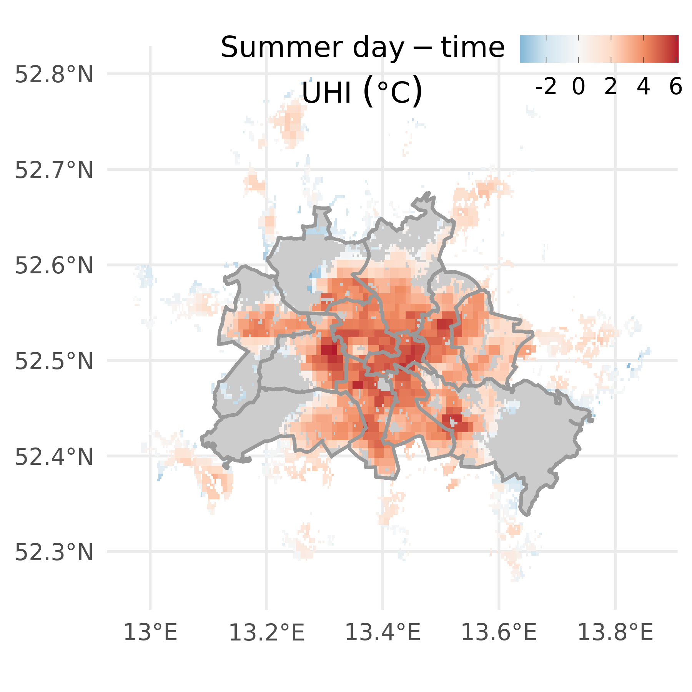
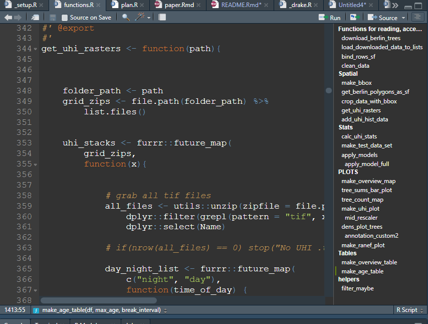

<!-- README.md is generated from README.Rmd. Please edit that file -->

# berlin.trees



## Purpose

This repository contains an analysis of tree growth (potential) and its
relationship with the Urban Heat Island (UHI) effect in Berlin using an
extensive, publicly available data set. For some details of the
(on-going) research, download this [file](./analysis/paper/paper.html)
and have a wee read if you like. Having a look at this first (mainly
figures) will help contextualize some of the workflow/code/results, I
think\!

## Approach

The folder structure follows the principal of a [**research
compendium**](https://research-compendium.science/) following concepts
developed by [Ben Marwick and
others](https://www.tandfonline.com/doi/abs/10.1080/00031305.2017.1375986?journalCode=utas20).
That means all analyses and the final write-up are organized in a
(fairly) coherent manner, encouraing reproducibility.

I chose to package up the analyses in an `R` package to facilitate
reproducibility, as dependencies are more easily tracked, and analyses
steps can be broken down into functions that can be tested, adjusted
when necessary, and most important, re-used. A brief overview and
benefits of that approach are detailed in my [blog post
here](https://the-hull.github.io/reproducibility_compendium/analyses/00_write-up.html).

A workflow-management software
[**`drake`**](https://github.com/ropensci/drake) and approach is also
something I’ve relied on heavily here, as the analysis is quickly
growing. While it takes time to get used to, and to implement, it has
already paid off massively when I had to go back and change
parameters/inputs. `drake` is extensively documented ([see
book](https://books.ropensci.org/drake/)), and I highly recommend it.

In brief:

  - Research compendium for coherent structure (based on `R` package;
    recognizable by others)
  - Packaged analyses steps/functions into `R package` (`berlin.trees`;
    call as `berlin.trees::my_function()` in scripts)
  - employed `drake` for managing analyses workflow

Below is a brief explanation of the repository structure, and important
files, as well as what drake does and how it relates to the analysis.

### Repository structure

The repo structure follows that of a typical `R` package. There are:

  - high-level files (this readme, `NAMESPACE`, `DESCRIPTION`) relating
    to typical `R` package development

  - high-level files relating to `drake` and its implementation
    (`make.R`, `_drake.R`)

  - high-level files that I use to get going with a package/compendium
    (`.Rprofile`, `_setup.R`)

  - `R` folder for functions

  - `man` folder for the documentation (i.e. help files) of the
    functions that pop-up in the Help viewer in `RStudio` (think of
    future you\!)

  - `analysis` that containts figures and the manuscript as a Rmarkdown
    / latex document

  - output papers from the “raw” (uncompiled) manuscript
    (`paper_knit.xyz`)

### Using `drake`

`drake` uses an analyses plan (a set of instructions) to generate
results. The great thing about `drake` is that it knows which
instructions depends on another (i.e. download data before plotting it,
than put it in a manuscript). The set of instructions are located in
`R/plan.R`, and outline all the steps that I take to generate results,
figures and rendering the final manuscript.

The files `make.R` and `_drake.R` both achieve the same thing, but in
different contexts (typically difference is running the pipeline on a
local `R` install vs. run on a server). If `plan.R` is the brain, the
above files are the muscles making things move. Note, that they are
generated automatically by `drake`, so you don’t need to worry that much
about what to put in them (`drake::use_drake()`).

The file `_setup.R` is typially what I work in to start the pipeline, or
add libraries to my analysis, and it contains the function
`drake::r_make()` that starts of the pipeline\!

#### The `plan.R`

`plan.R` is structured following the entire analyses from downloading
tabular and spatial data, cleaning it, producing stats and plots, and
then compiling the manuscript. I typically seperate indivudal steps with
`# Step -----------` as that gives you a neat outline in `RStudio` (if
click the lines symbol above the scroll-bar in the script window). Every
analyses step is named, and that name can then be used in a sub-sequent
step (this is how drake manages dependencies). For example, see this
taken directly from the documentation for a fairly self-explanatory
application:


`drake` caches (intermediate) results and keeps track of any changes to
them, and tells you which parts steps will be re-executed next time to
finish of the pipeline\! Super cool. Any intermediate result can, for
example, be inspected using `drake::readd(X)` or `drake::loadd()`, and
this is also how you include results in e.g. an `Rmarkdown` report.

### Workflow

Note, that I’ve added some descriptions to the steps in `plan.R`, but
typically I rely on the function help that I generate in
`R/functions.R`. The workflow I apply there is typically iterative, so I
play around in a few dump/script files (`analyses/scripts/...`) and then
refactor the code for a specific use into a function. As I’ve bundled
the analysis into a package, any (properly formatted) documentation in
the functions is then accessible using `berlin.trees::my_function()`,
and should I forget what a function does, I put my cursor on the
function name and hit `F1` - the help then appears in the `RStudio`
viewer. I try to use verbs and wordy function names so I hope that most
things would be self-explanatory (at least for myself). This also works
for documenting data sets (e.g. try `?iris` in your `R` console) - and
can be super helpful\!

Once functions are coded and the plan configured, I typically navigate
to the file `_setup.R` (either using the shortcud `CTRL+.` or clicking)
to run `drake::r_make()` and a few other things, or I just execute the
latter command directly in the console. `drake` then let’s you know
what’s up\!

### Code

As mentioned before, I typically break down analyses into many steps,
and use wordy names to indicate what they do. I haven’t implemented
formal unit testing here, but I’m quite thorough with checking outputs
(especially in exploratory analyses), and doing sanity checks on
outputs. With the break-down approach, things tend to stay fairly
straightforward for every step, and I only comment code where entirely
necessary (for myself so far). I do try to keep the functions organized
(using `# Section ----------` - ), so that an outline appears in
`RStudio`:



That really helps navigating\!

### Review / Feedback

As Tom said, don’t spend too much time going through individual things\!
I think having a look at the structure, and whether it’s
“straightforward” to follow along would be most useful, especially
given that there are two potentially new concepts here (`R package`
development and `drake`) Thanks for having a go\!\!

<!-- [](https://mybinder.org/v2/gh///master?urlpath=rstudio) -->

<!-- This repository contains the data and code for our paper: -->

<!-- > Authors, (YYYY). _Title of your paper goes here_. Name of journal/book <https://doi.org/xxx/xxx> -->

<!-- Our pre-print is online here: -->

<!-- > Authors, (YYYY). _Title of your paper goes here_. Name of journal/book, Accessed 20 Apr 2020. Online at <https://doi.org/xxx/xxx> -->

<!-- ### How to cite -->

<!-- Please cite this compendium as: -->

<!-- > Authors, (2020). _Compendium of R code and data for Title of your paper goes here_. Accessed 20 Apr 2020. Online at <https://doi.org/xxx/xxx> -->

<!-- ### How to download or install -->

<!-- You can download the compendium as a zip from from this URL: </archive/master.zip> -->

<!-- Or you can install this compendium as an R package, berlin.trees, from GitHub with: -->

<!-- ```{r gh-installation, eval = FALSE} -->

<!-- # install.packages("devtools") -->

<!-- remotes::install_github("/") -->

<!-- ``` -->

<!-- ### Licenses -->

<!-- **Text and figures :**  [CC-BY-4.0](http://creativecommons.org/licenses/by/4.0/) -->

<!-- **Code :** See the [DESCRIPTION](DESCRIPTION) file -->

<!-- **Data :** [CC-0](http://creativecommons.org/publicdomain/zero/1.0/) attribution requested in reuse -->

<!-- ### Contributions -->

<!-- We welcome contributions from everyone. Before you get started, please see our [contributor guidelines](CONTRIBUTING.md). Please note that this project is released with a [Contributor Code of Conduct](CONDUCT.md). By participating in this project you agree to abide by its terms. -->
