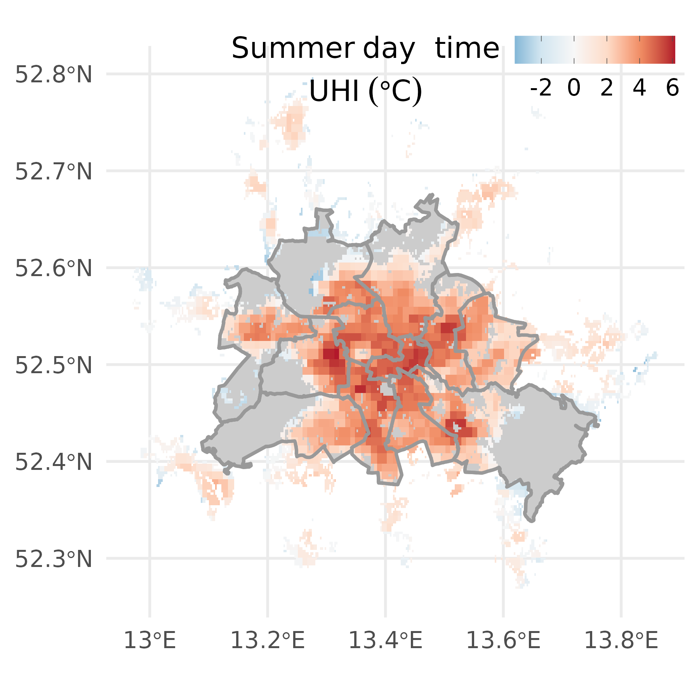

<!-- README.md is generated from README.Rmd. Please edit that file -->

# berlin.trees

Repository for **Assessing the impact of urban heating on tree growth in
Berlin with open inventory and environmental data**

## Purpose

This repository contains an analysis of tree growth (potential) and its
relationship with the Urban Heat Island (UHI) effect in Berlin using an
extensive, publicly available data set. The paper can be
viewed/downloaded here as an [html
file](./analysis/paper/paper_knit.html), or as a [docx
file](./analysis/paper/Hurley-et-al_UFUG_berlin-trees.docx).

## Approach

The folder structure uses the principal of a [**research
compendium**](https://research-compendium.science/) following concepts
developed by [Ben Marwick and
others](https://www.tandfonline.com/doi/abs/10.1080/00031305.2017.1375986?journalCode=utas20).
That means all analyses and the final write-up are organized in a
(fairly) coherent manner, encouraging reproducibility.

A workflow-management software
[**`drake`**](https://github.com/ropensci/drake) is implemented to run
(and re-run) all analyses steps, ultimately producing the manuscript,
supporting information, etc. `drake` is extensively documented ([see
book](https://books.ropensci.org/drake/)), and is highly recommended.
Note, however, that it is now superseded by the `targets` package.

### Repository structure

The repo structure follows that of a typical `R` package. There are:

-   high-level files (this readme, `NAMESPACE`, `DESCRIPTION`) relating
    to typical `R` package/compendium development

-   high-level files relating to `drake` and its implementation
    (`make.R`, `_drake.R`, `plan.R`)

-   high-level files that I use to get going with a package/compendium
    (`.Rprofile`, `_setup.R`)

-   `R` folder for functions (these are used in `plan.R` to drive the
    analyses)

-   `analysis` that contains raw and derived data, figures and the
    manuscript in different formats

### Using `drake`

#### The `plan.R`

`plan.R` is structured following the entire analyses from downloading
tabular and spatial data, cleaning it, producing stats and plots, and
then compiling the manuscript using functions. 
Every analyses step is named, and that name can then be used in a
sub-sequent step (this is how drake manages dependencies).

### Workflow

Note, that I’ve added some descriptions to the steps in `plan.R`, but
typically I rely on the function help that I generate in
`R/functions.R`.
