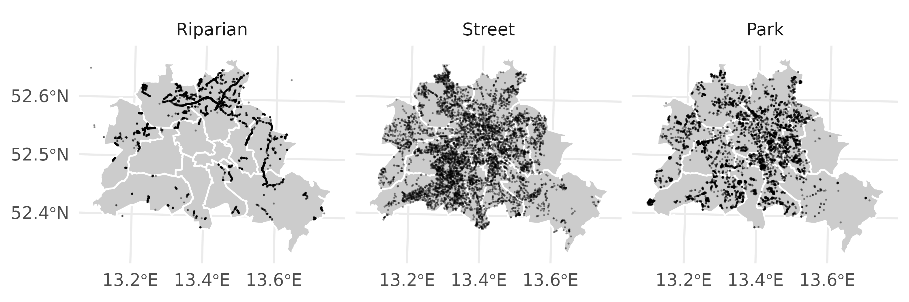

<!--     bookdown::word_document2: -->
<!--       fig_caption: yes -->
<!--       reference_docx: "../templates/template.docx" # Insert path for the DOCX file -->
<!--       pandoc_args: -->
<!--       - --lua-filter=../templates/scholarly-metadata.lua -->
<!--       - --lua-filter=../templates/author-info-blocks.lua -->
<!--       - --lua-filter=../templates/pagebreak.lua -->


<!-- This is the format for text comments that will be ignored during renderings. Do not put R code in these comments because it will not be ignored. -->

```{r setup, echo = FALSE, cache = FALSE, include = FALSE}
knitr::opts_knit$set(root.dir = here::here())

knitr::opts_chunk$set(
  fig.align = "center",
  collapse = TRUE,
  warning = FALSE,
  message = FALSE,
  echo = FALSE,
  comment = "#>",
  # fig.path = "../figures/",
  fig.path = paste0(file.path(here::here(), "analysis", "figures"), "/"),
  dpi = 300
)


library(drake)
library(ggplot2)
library(patchwork)
```

# Introduction

Here is a citation [@Marwick2017]

# Background

# Methods

# Results

Some results

```{r fig-tree-overview-map, fig.cap="A plot of random numbers",fig.width = 15, fig.height = 8, out.width="100%", include=TRUE, eval=TRUE}

# loadd(full_data_set_clean)
# loadd(plot_overview_map)
# print(class(full_data_set_clean))


# knitr::include_graphics(drake::file_in("./analysis/figures/map_01_overview.png"))


loadd(plot_overview_map)
knitr::include_graphics(file.path(here::here(), "analysis", "figures", "map_01_overview.png"))
# 
# print(dir(path = "./analysis/figures"  ))
# readd(plot_overview_map) + 
#      +
#     labs(caption = NULL)

# plot_overview_map

```


```{r fig-uhi, fig.cap="A plot of random numbers",fig.width = 15, fig.height = 8, out.width="100%", include=TRUE, eval=TRUE}

loadd(plot_uhi_map)
knitr::include_graphics(file.path(here::here(),
                                                 "analysis", 
                                                 "figures", 
                                                 "map_03_uhi.png"))
# knitr::include_graphics(drake::file_in(file.path(here::here(),
#                                                  "analysis", 
#                                                  "figures", 
#                                                  "map_03_uhi.png")))

```


```{r fig-tree-count-map, fig.cap="A plot of random numbers",fig.width = 12, fig.height = 14, out.width="100%"}


loadd(plot_count_map)
knitr::include_graphics(file.path(here::here(), "analysis", "figures", "map_02_tree_sums_standardized.png"))


# readd(plot_count_map) + 
#   labs(caption = NULL) +
#   theme(legend.position = c(0.65, 0.1),
#         legend.key.width = unit(3, units = "cm")) +
#   guides(color = guide_colorbar(title.position = "top"))
  

# plot_count_map

# plot(1:10)
```


```{r fig-count-bars, fig.cap="A plot of random numbers",fig.width = 6, fig.height = 6, out.width="50%", include = FALSE, eval = FALSE}
loadd(plot_tree_sums_bar)
knitr::include_graphics(file.path(here::here(), "analysis", "figures", "plot_01_tree_sums_bar.png"))


# plot(1:10)
```

```{r fig-density, fig.cap="A plot of random numbers",fig.width = 12, fig.height = 12, out.width="100%"}
loadd(plot_density)
knitr::include_graphics(file.path(here::here(), "analysis", "figures", "plot_02_genus_UHI_dens.png"))


# plot(1:10)
```


```{r fig-lmestat, fig.cap="A plot of random numbers",fig.width = 20, fig.height = 12, out.width="100%"}
loadd(plot_LME_age)
knitr::include_graphics(file.path(here::here(), "analysis", "figures", "plot_03_ranef_species_dbh_uhi.png"))

# plot(1:10)
```


<!-- Figure \@ref(fig:demo-plot) shows how we can have a caption and cross-reference for a plot -->

# Discussion

# Conclusion

# Acknowledgements

<!-- The following line inserts a page break  -->
\newpage

# References 
<!-- The following line ensures the references appear here for the MS Word or HTML output files, rather than right at the end of the document (this will not work for PDF files):  -->
<div id="refs"></div>

\newpage

### Colophon

This report was generated on `r Sys.time()` using the following computational environment and dependencies: 

```{r colophon, cache = FALSE}
# which R packages and versions?
if ("devtools" %in% installed.packages()) devtools::session_info()
```

The current Git commit details are:

```{r}
# what commit is this file at? 
if ("git2r" %in% installed.packages() & git2r::in_repository(path = ".")) git2r::repository(here::here())  
```
